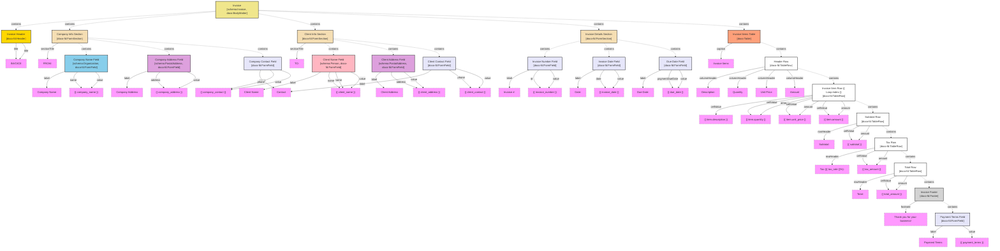

```mermaid
graph TD
    %% Node Types
    invoice["Invoice\n[schema:Invoice, doco:BodyMatter]"]:::typedNode
    style invoice fill:#F0E68C,stroke:#333
    invoice_header["Invoice Header\n[doco-fd:Header]"]:::typedNode
    style invoice_header fill:#FFD700,stroke:#333
    company_info_section["Company Info Section\n[doco-fd:FormSection]"]:::typedNode
    style company_info_section fill:#F5DEB3,stroke:#333
    company_name_field["Company Name Field\n[schema:Organization, doco-fd:FormField]"]:::typedNode
    style company_name_field fill:#87CEEB,stroke:#333
    company_address_field["Company Address Field\n[schema:PostalAddress, doco-fd:FormField]"]:::typedNode
    style company_address_field fill:#DDA0DD,stroke:#333
    company_contact_field["Company Contact Field\n[doco-fd:FormField]"]:::typedNode
    style company_contact_field fill:#E6E6FA,stroke:#333
    client_info_section["Client Info Section\n[doco-fd:FormSection]"]:::typedNode
    style client_info_section fill:#F5DEB3,stroke:#333
    client_name_field["Client Name Field\n[schema:Person, doco-fd:FormField]"]:::typedNode
    style client_name_field fill:#FFB6C1,stroke:#333
    client_address_field["Client Address Field\n[schema:PostalAddress, doco-fd:FormField]"]:::typedNode
    style client_address_field fill:#DDA0DD,stroke:#333
    client_contact_field["Client Contact Field\n[doco-fd:FormField]"]:::typedNode
    style client_contact_field fill:#E6E6FA,stroke:#333
    invoice_details_section["Invoice Details Section\n[doco-fd:FormSection]"]:::typedNode
    style invoice_details_section fill:#F5DEB3,stroke:#333
    invoice_number_field["Invoice Number Field\n[doco-fd:FormField]"]:::typedNode
    style invoice_number_field fill:#E6E6FA,stroke:#333
    invoice_date_field["Invoice Date Field\n[doco-fd:FormField]"]:::typedNode
    style invoice_date_field fill:#E6E6FA,stroke:#333
    due_date_field["Due Date Field\n[doco-fd:FormField]"]:::typedNode
    style due_date_field fill:#E6E6FA,stroke:#333
    invoice_items_table["Invoice Items Table\n[doco:Table]"]:::typedNode
    style invoice_items_table fill:#FFA07A,stroke:#333
    header_row["Header Row\n[doco-fd:TableRow]"]:::typedNode
    style header_row fill:#FFFFFF,stroke:#333
    invoice_item_row____loop_index___["Invoice Item Row {{ Loop.Index }}\n[doco-fd:TableRow]"]:::typedNode
    style invoice_item_row____loop_index___ fill:#FFFFFF,stroke:#333
    subtotal_row["Subtotal Row\n[doco-fd:TableRow]"]:::typedNode
    style subtotal_row fill:#FFFFFF,stroke:#333
    tax_row["Tax Row\n[doco-fd:TableRow]"]:::typedNode
    style tax_row fill:#FFFFFF,stroke:#333
    total_row["Total Row\n[doco-fd:TableRow]"]:::typedNode
    style total_row fill:#FFFFFF,stroke:#333
    invoice_footer["Invoice Footer\n[doco-fd:Footer]"]:::typedNode
    style invoice_footer fill:#D3D3D3,stroke:#333
    payment_terms_field["Payment Terms Field\n[doco-fd:FormField]"]:::typedNode
    style payment_terms_field fill:#E6E6FA,stroke:#333

    %% Relationships
    value_5400["INVOICE"]:::valueNode
    invoice_header -->|title| value_5400
    style value_5400 fill:#f9f,stroke:#666
    value_5400["INVOICE"]:::valueNode
    invoice_header -->|title| value_5400
    style value_5400 fill:#f9f,stroke:#666
    value_7061["FROM:"]:::valueNode
    company_info_section -->|sectionTitle| value_7061
    style value_7061 fill:#f9f,stroke:#666
    value_5288["Company Name"]:::valueNode
    company_name_field -->|label| value_5288
    style value_5288 fill:#f9f,stroke:#666
    value_2981["{{ company_name }}"]:::valueNode
    company_name_field -->|name| value_2981
    style value_2981 fill:#f9f,stroke:#666
    value_2981["{{ company_name }}"]:::valueNode
    company_name_field -->|value| value_2981
    style value_2981 fill:#f9f,stroke:#666
    value_5376["Company Address"]:::valueNode
    company_address_field -->|label| value_5376
    style value_5376 fill:#f9f,stroke:#666
    value_3132["{{ company_address }}"]:::valueNode
    company_address_field -->|address| value_3132
    style value_3132 fill:#f9f,stroke:#666
    value_3132["{{ company_address }}"]:::valueNode
    company_address_field -->|value| value_3132
    style value_3132 fill:#f9f,stroke:#666
    value_5584["Contact"]:::valueNode
    company_contact_field -->|label| value_5584
    style value_5584 fill:#f9f,stroke:#666
    value_4518["{{ company_contact }}"]:::valueNode
    company_contact_field -->|phone| value_4518
    style value_4518 fill:#f9f,stroke:#666
    value_4518["{{ company_contact }}"]:::valueNode
    company_contact_field -->|value| value_4518
    style value_4518 fill:#f9f,stroke:#666
    value_1879["TO:"]:::valueNode
    client_info_section -->|sectionTitle| value_1879
    style value_1879 fill:#f9f,stroke:#666
    value_4718["Client Name"]:::valueNode
    client_name_field -->|label| value_4718
    style value_4718 fill:#f9f,stroke:#666
    value_9532["{{ client_name }}"]:::valueNode
    client_name_field -->|name| value_9532
    style value_9532 fill:#f9f,stroke:#666
    value_9532["{{ client_name }}"]:::valueNode
    client_name_field -->|name| value_9532
    style value_9532 fill:#f9f,stroke:#666
    value_9532["{{ client_name }}"]:::valueNode
    client_name_field -->|value| value_9532
    style value_9532 fill:#f9f,stroke:#666
    value_9572["Client Address"]:::valueNode
    client_address_field -->|label| value_9572
    style value_9572 fill:#f9f,stroke:#666
    value_9318["{{ client_address }}"]:::valueNode
    client_address_field -->|address| value_9318
    style value_9318 fill:#f9f,stroke:#666
    value_9318["{{ client_address }}"]:::valueNode
    client_address_field -->|value| value_9318
    style value_9318 fill:#f9f,stroke:#666
    value_5584["Contact"]:::valueNode
    client_contact_field -->|label| value_5584
    style value_5584 fill:#f9f,stroke:#666
    value_1642["{{ client_contact }}"]:::valueNode
    client_contact_field -->|phone| value_1642
    style value_1642 fill:#f9f,stroke:#666
    value_1642["{{ client_contact }}"]:::valueNode
    client_contact_field -->|value| value_1642
    style value_1642 fill:#f9f,stroke:#666
    value_2646["Invoice #:"]:::valueNode
    invoice_number_field -->|label| value_2646
    style value_2646 fill:#f9f,stroke:#666
    value_4258["{{ invoice_number }}"]:::valueNode
    invoice_number_field -->|id| value_4258
    style value_4258 fill:#f9f,stroke:#666
    value_4258["{{ invoice_number }}"]:::valueNode
    invoice_number_field -->|value| value_4258
    style value_4258 fill:#f9f,stroke:#666
    value_1874["Date:"]:::valueNode
    invoice_date_field -->|label| value_1874
    style value_1874 fill:#f9f,stroke:#666
    value_258["{{ invoice_date }}"]:::valueNode
    invoice_date_field -->|date| value_258
    style value_258 fill:#f9f,stroke:#666
    value_258["{{ invoice_date }}"]:::valueNode
    invoice_date_field -->|value| value_258
    style value_258 fill:#f9f,stroke:#666
    value_4800["Due Date:"]:::valueNode
    due_date_field -->|label| value_4800
    style value_4800 fill:#f9f,stroke:#666
    value_1076["{{ due_date }}"]:::valueNode
    due_date_field -->|paymentDueDate| value_1076
    style value_1076 fill:#f9f,stroke:#666
    value_1076["{{ due_date }}"]:::valueNode
    due_date_field -->|value| value_1076
    style value_1076 fill:#f9f,stroke:#666
    value_6204["Invoice Items"]:::valueNode
    invoice_items_table -->|caption| value_6204
    style value_6204 fill:#f9f,stroke:#666
    value_3708["Description"]:::valueNode
    header_row -->|columnHeader| value_3708
    style value_3708 fill:#f9f,stroke:#666
    value_6144["Quantity"]:::valueNode
    header_row -->|columnHeader| value_6144
    style value_6144 fill:#f9f,stroke:#666
    value_6731["Unit Price"]:::valueNode
    header_row -->|columnHeader| value_6731
    style value_6731 fill:#f9f,stroke:#666
    value_2508["Amount"]:::valueNode
    header_row -->|columnHeader| value_2508
    style value_2508 fill:#f9f,stroke:#666
    value_8687["{{ item.description }}"]:::valueNode
    invoice_item_row____loop_index___ -->|cellValue| value_8687
    style value_8687 fill:#f9f,stroke:#666
    value_2887["{{ item.quantity }}"]:::valueNode
    invoice_item_row____loop_index___ -->|cellValue| value_2887
    style value_2887 fill:#f9f,stroke:#666
    value_2887["{{ item.quantity }}"]:::valueNode
    invoice_item_row____loop_index___ -->|amount| value_2887
    style value_2887 fill:#f9f,stroke:#666
    value_3299["{{ item.unit_price }}"]:::valueNode
    invoice_item_row____loop_index___ -->|cellValue| value_3299
    style value_3299 fill:#f9f,stroke:#666
    value_3299["{{ item.unit_price }}"]:::valueNode
    invoice_item_row____loop_index___ -->|amount| value_3299
    style value_3299 fill:#f9f,stroke:#666
    value_4003["{{ item.amount }}"]:::valueNode
    invoice_item_row____loop_index___ -->|cellValue| value_4003
    style value_4003 fill:#f9f,stroke:#666
    value_4003["{{ item.amount }}"]:::valueNode
    invoice_item_row____loop_index___ -->|amount| value_4003
    style value_4003 fill:#f9f,stroke:#666
    value_6744["Subtotal:"]:::valueNode
    subtotal_row -->|rowHeader| value_6744
    style value_6744 fill:#f9f,stroke:#666
    value_4521["{{ subtotal }}"]:::valueNode
    subtotal_row -->|cellValue| value_4521
    style value_4521 fill:#f9f,stroke:#666
    value_4521["{{ subtotal }}"]:::valueNode
    subtotal_row -->|amount| value_4521
    style value_4521 fill:#f9f,stroke:#666
    value_8144["Tax ({{ tax_rate }}%):"]:::valueNode
    tax_row -->|rowHeader| value_8144
    style value_8144 fill:#f9f,stroke:#666
    value_8781["{{ tax_amount }}"]:::valueNode
    tax_row -->|cellValue| value_8781
    style value_8781 fill:#f9f,stroke:#666
    value_8781["{{ tax_amount }}"]:::valueNode
    tax_row -->|amount| value_8781
    style value_8781 fill:#f9f,stroke:#666
    value_3197["Total:"]:::valueNode
    total_row -->|rowHeader| value_3197
    style value_3197 fill:#f9f,stroke:#666
    value_1755["{{ total_amount }}"]:::valueNode
    total_row -->|cellValue| value_1755
    style value_1755 fill:#f9f,stroke:#666
    value_1755["{{ total_amount }}"]:::valueNode
    total_row -->|amount| value_1755
    style value_1755 fill:#f9f,stroke:#666
    value_9776["Thank you for your business!"]:::valueNode
    invoice_footer -->|footnote| value_9776
    style value_9776 fill:#f9f,stroke:#666
    value_7771["Payment Terms"]:::valueNode
    payment_terms_field -->|label| value_7771
    style value_7771 fill:#f9f,stroke:#666
    value_582["{{ payment_terms }}"]:::valueNode
    payment_terms_field -->|value| value_582
    style value_582 fill:#f9f,stroke:#666

    %% Hierarchy (containment)
    invoice -.->|contains| invoice_header
    invoice -.->|contains| company_info_section
    invoice -.->|contains| client_info_section
    invoice -.->|contains| invoice_details_section
    invoice -.->|contains| invoice_items_table
    company_info_section -.->|contains| company_name_field
    company_info_section -.->|contains| company_address_field
    company_info_section -.->|contains| company_contact_field
    client_info_section -.->|contains| client_name_field
    client_info_section -.->|contains| client_address_field
    client_info_section -.->|contains| client_contact_field
    invoice_details_section -.->|contains| invoice_number_field
    invoice_details_section -.->|contains| invoice_date_field
    invoice_details_section -.->|contains| due_date_field
    invoice_items_table -.->|contains| header_row
    header_row -.->|contains| invoice_item_row____loop_index___
    invoice_item_row____loop_index___ -.->|contains| subtotal_row
    subtotal_row -.->|contains| tax_row
    tax_row -.->|contains| total_row
    total_row -.->|contains| invoice_footer
    invoice_footer -.->|contains| payment_terms_field

    classDef typedNode fill:#fff,stroke:#333,stroke-width:2px
    classDef valueNode fill:#f9f,stroke:#666,stroke-dasharray: 5 5
```
