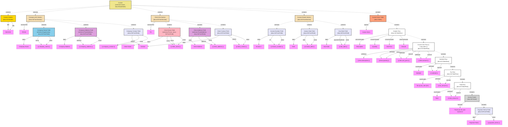

```mermaid
graph TD
    %% Node Types
    invoice["Invoice\n[schema:Invoice, doco:BodyMatter]"]:::typedNode
    style invoice fill:#F0E68C,stroke:#333
    invoice_header["Invoice Header\n[doco-fd:Header]"]:::typedNode
    style invoice_header fill:#FFD700,stroke:#333
    company_info_section["Company Info Section\n[doco-fd:FormSection]"]:::typedNode
    style company_info_section fill:#F5DEB3,stroke:#333
    company_name_field["Company Name Field\n[schema:Organization, doco-fd:FormField]"]:::typedNode
    style company_name_field fill:#87CEEB,stroke:#333
    company_address_field["Company Address Field\n[schema:PostalAddress, doco-fd:FormField]"]:::typedNode
    style company_address_field fill:#DDA0DD,stroke:#333
    company_contact_field["Company Contact Field\n[doco-fd:FormField]"]:::typedNode
    style company_contact_field fill:#E6E6FA,stroke:#333
    client_info_section["Client Info Section\n[doco-fd:FormSection]"]:::typedNode
    style client_info_section fill:#F5DEB3,stroke:#333
    client_name_field["Client Name Field\n[schema:Person, doco-fd:FormField]"]:::typedNode
    style client_name_field fill:#FFB6C1,stroke:#333
    client_address_field["Client Address Field\n[schema:PostalAddress, doco-fd:FormField]"]:::typedNode
    style client_address_field fill:#DDA0DD,stroke:#333
    client_contact_field["Client Contact Field\n[doco-fd:FormField]"]:::typedNode
    style client_contact_field fill:#E6E6FA,stroke:#333
    invoice_details_section["Invoice Details Section\n[doco-fd:FormSection]"]:::typedNode
    style invoice_details_section fill:#F5DEB3,stroke:#333
    invoice_number_field["Invoice Number Field\n[doco-fd:FormField]"]:::typedNode
    style invoice_number_field fill:#E6E6FA,stroke:#333
    invoice_date_field["Invoice Date Field\n[doco-fd:FormField]"]:::typedNode
    style invoice_date_field fill:#E6E6FA,stroke:#333
    due_date_field["Due Date Field\n[doco-fd:FormField]"]:::typedNode
    style due_date_field fill:#E6E6FA,stroke:#333
    invoice_items_table["Invoice Items Table\n[doco:Table]"]:::typedNode
    style invoice_items_table fill:#FFA07A,stroke:#333
    header_row["Header Row\n[doco-fd:TableRow]"]:::typedNode
    style header_row fill:#FFFFFF,stroke:#333
    invoice_item_row____loop_index___["Invoice Item Row {{ Loop.Index }}\n[doco-fd:TableRow]"]:::typedNode
    style invoice_item_row____loop_index___ fill:#FFFFFF,stroke:#333
    subtotal_row["Subtotal Row\n[doco-fd:TableRow]"]:::typedNode
    style subtotal_row fill:#FFFFFF,stroke:#333
    tax_row["Tax Row\n[doco-fd:TableRow]"]:::typedNode
    style tax_row fill:#FFFFFF,stroke:#333
    total_row["Total Row\n[doco-fd:TableRow]"]:::typedNode
    style total_row fill:#FFFFFF,stroke:#333
    invoice_footer["Invoice Footer\n[doco-fd:Footer]"]:::typedNode
    style invoice_footer fill:#D3D3D3,stroke:#333
    payment_terms_field["Payment Terms Field\n[doco-fd:FormField]"]:::typedNode
    style payment_terms_field fill:#E6E6FA,stroke:#333

    %% Relationships
    value_5758["INVOICE"]:::valueNode
    invoice_header -->|title| value_5758
    style value_5758 fill:#f9f,stroke:#666
    value_5758["INVOICE"]:::valueNode
    invoice_header -->|title| value_5758
    style value_5758 fill:#f9f,stroke:#666
    value_1673["FROM:"]:::valueNode
    company_info_section -->|sectionTitle| value_1673
    style value_1673 fill:#f9f,stroke:#666
    value_2593["Company Name"]:::valueNode
    company_name_field -->|label| value_2593
    style value_2593 fill:#f9f,stroke:#666
    value_8562["{{ company_name }}"]:::valueNode
    company_name_field -->|name| value_8562
    style value_8562 fill:#f9f,stroke:#666
    value_8562["{{ company_name }}"]:::valueNode
    company_name_field -->|value| value_8562
    style value_8562 fill:#f9f,stroke:#666
    value_1426["Company Address"]:::valueNode
    company_address_field -->|label| value_1426
    style value_1426 fill:#f9f,stroke:#666
    value_5159["{{ company_address }}"]:::valueNode
    company_address_field -->|address| value_5159
    style value_5159 fill:#f9f,stroke:#666
    value_5159["{{ company_address }}"]:::valueNode
    company_address_field -->|value| value_5159
    style value_5159 fill:#f9f,stroke:#666
    value_8018["Contact"]:::valueNode
    company_contact_field -->|label| value_8018
    style value_8018 fill:#f9f,stroke:#666
    value_8439["{{ company_contact }}"]:::valueNode
    company_contact_field -->|phone| value_8439
    style value_8439 fill:#f9f,stroke:#666
    value_8439["{{ company_contact }}"]:::valueNode
    company_contact_field -->|value| value_8439
    style value_8439 fill:#f9f,stroke:#666
    value_3849["TO:"]:::valueNode
    client_info_section -->|sectionTitle| value_3849
    style value_3849 fill:#f9f,stroke:#666
    value_7505["Client Name"]:::valueNode
    client_name_field -->|label| value_7505
    style value_7505 fill:#f9f,stroke:#666
    value_7132["{{ client_name }}"]:::valueNode
    client_name_field -->|name| value_7132
    style value_7132 fill:#f9f,stroke:#666
    value_7132["{{ client_name }}"]:::valueNode
    client_name_field -->|name| value_7132
    style value_7132 fill:#f9f,stroke:#666
    value_7132["{{ client_name }}"]:::valueNode
    client_name_field -->|value| value_7132
    style value_7132 fill:#f9f,stroke:#666
    value_3741["Client Address"]:::valueNode
    client_address_field -->|label| value_3741
    style value_3741 fill:#f9f,stroke:#666
    value_5585["{{ client_address }}"]:::valueNode
    client_address_field -->|address| value_5585
    style value_5585 fill:#f9f,stroke:#666
    value_5585["{{ client_address }}"]:::valueNode
    client_address_field -->|value| value_5585
    style value_5585 fill:#f9f,stroke:#666
    value_8018["Contact"]:::valueNode
    client_contact_field -->|label| value_8018
    style value_8018 fill:#f9f,stroke:#666
    value_3199["{{ client_contact }}"]:::valueNode
    client_contact_field -->|phone| value_3199
    style value_3199 fill:#f9f,stroke:#666
    value_3199["{{ client_contact }}"]:::valueNode
    client_contact_field -->|value| value_3199
    style value_3199 fill:#f9f,stroke:#666
    value_8559["Invoice #:"]:::valueNode
    invoice_number_field -->|label| value_8559
    style value_8559 fill:#f9f,stroke:#666
    value_147["{{ invoice_number }}"]:::valueNode
    invoice_number_field -->|id| value_147
    style value_147 fill:#f9f,stroke:#666
    value_147["{{ invoice_number }}"]:::valueNode
    invoice_number_field -->|value| value_147
    style value_147 fill:#f9f,stroke:#666
    value_9838["Date:"]:::valueNode
    invoice_date_field -->|label| value_9838
    style value_9838 fill:#f9f,stroke:#666
    value_5546["{{ invoice_date }}"]:::valueNode
    invoice_date_field -->|date| value_5546
    style value_5546 fill:#f9f,stroke:#666
    value_5546["{{ invoice_date }}"]:::valueNode
    invoice_date_field -->|value| value_5546
    style value_5546 fill:#f9f,stroke:#666
    value_8596["Due Date:"]:::valueNode
    due_date_field -->|label| value_8596
    style value_8596 fill:#f9f,stroke:#666
    value_3195["{{ due_date }}"]:::valueNode
    due_date_field -->|paymentDueDate| value_3195
    style value_3195 fill:#f9f,stroke:#666
    value_3195["{{ due_date }}"]:::valueNode
    due_date_field -->|value| value_3195
    style value_3195 fill:#f9f,stroke:#666
    value_8454["Invoice Items"]:::valueNode
    invoice_items_table -->|caption| value_8454
    style value_8454 fill:#f9f,stroke:#666
    value_1427["Description"]:::valueNode
    header_row -->|columnHeader| value_1427
    style value_1427 fill:#f9f,stroke:#666
    value_6641["Quantity"]:::valueNode
    header_row -->|columnHeader| value_6641
    style value_6641 fill:#f9f,stroke:#666
    value_1215["Unit Price"]:::valueNode
    header_row -->|columnHeader| value_1215
    style value_1215 fill:#f9f,stroke:#666
    value_6914["Amount"]:::valueNode
    header_row -->|columnHeader| value_6914
    style value_6914 fill:#f9f,stroke:#666
    value_550["{{ item.description }}"]:::valueNode
    invoice_item_row____loop_index___ -->|cellValue| value_550
    style value_550 fill:#f9f,stroke:#666
    value_9679["{{ item.quantity }}"]:::valueNode
    invoice_item_row____loop_index___ -->|cellValue| value_9679
    style value_9679 fill:#f9f,stroke:#666
    value_9679["{{ item.quantity }}"]:::valueNode
    invoice_item_row____loop_index___ -->|amount| value_9679
    style value_9679 fill:#f9f,stroke:#666
    value_8460["{{ item.unit_price }}"]:::valueNode
    invoice_item_row____loop_index___ -->|cellValue| value_8460
    style value_8460 fill:#f9f,stroke:#666
    value_8460["{{ item.unit_price }}"]:::valueNode
    invoice_item_row____loop_index___ -->|amount| value_8460
    style value_8460 fill:#f9f,stroke:#666
    value_3725["{{ item.amount }}"]:::valueNode
    invoice_item_row____loop_index___ -->|cellValue| value_3725
    style value_3725 fill:#f9f,stroke:#666
    value_3725["{{ item.amount }}"]:::valueNode
    invoice_item_row____loop_index___ -->|amount| value_3725
    style value_3725 fill:#f9f,stroke:#666
    value_3630["Subtotal:"]:::valueNode
    subtotal_row -->|rowHeader| value_3630
    style value_3630 fill:#f9f,stroke:#666
    value_9212["{{ subtotal }}"]:::valueNode
    subtotal_row -->|cellValue| value_9212
    style value_9212 fill:#f9f,stroke:#666
    value_9212["{{ subtotal }}"]:::valueNode
    subtotal_row -->|amount| value_9212
    style value_9212 fill:#f9f,stroke:#666
    value_7763["Tax ({{ tax_rate }}%):"]:::valueNode
    tax_row -->|rowHeader| value_7763
    style value_7763 fill:#f9f,stroke:#666
    value_2894["{{ tax_amount }}"]:::valueNode
    tax_row -->|cellValue| value_2894
    style value_2894 fill:#f9f,stroke:#666
    value_2894["{{ tax_amount }}"]:::valueNode
    tax_row -->|amount| value_2894
    style value_2894 fill:#f9f,stroke:#666
    value_5052["Total:"]:::valueNode
    total_row -->|rowHeader| value_5052
    style value_5052 fill:#f9f,stroke:#666
    value_9642["{{ total_amount }}"]:::valueNode
    total_row -->|cellValue| value_9642
    style value_9642 fill:#f9f,stroke:#666
    value_9642["{{ total_amount }}"]:::valueNode
    total_row -->|amount| value_9642
    style value_9642 fill:#f9f,stroke:#666
    value_3180["Thank you for your business!"]:::valueNode
    invoice_footer -->|footnote| value_3180
    style value_3180 fill:#f9f,stroke:#666
    value_1650["Payment Terms"]:::valueNode
    payment_terms_field -->|label| value_1650
    style value_1650 fill:#f9f,stroke:#666
    value_2336["{{ payment_terms }}"]:::valueNode
    payment_terms_field -->|value| value_2336
    style value_2336 fill:#f9f,stroke:#666

    %% Hierarchy (containment)
    invoice -.->|contains| invoice_header
    invoice -.->|contains| company_info_section
    invoice -.->|contains| client_info_section
    invoice -.->|contains| invoice_details_section
    invoice -.->|contains| invoice_items_table
    company_info_section -.->|contains| company_name_field
    company_info_section -.->|contains| company_address_field
    company_info_section -.->|contains| company_contact_field
    client_info_section -.->|contains| client_name_field
    client_info_section -.->|contains| client_address_field
    client_info_section -.->|contains| client_contact_field
    invoice_details_section -.->|contains| invoice_number_field
    invoice_details_section -.->|contains| invoice_date_field
    invoice_details_section -.->|contains| due_date_field
    invoice_items_table -.->|contains| header_row
    header_row -.->|contains| invoice_item_row____loop_index___
    invoice_item_row____loop_index___ -.->|contains| subtotal_row
    subtotal_row -.->|contains| tax_row
    tax_row -.->|contains| total_row
    total_row -.->|contains| invoice_footer
    invoice_footer -.->|contains| payment_terms_field

    classDef typedNode fill:#fff,stroke:#333,stroke-width:2px
    classDef valueNode fill:#f9f,stroke:#666,stroke-dasharray: 5 5
```
